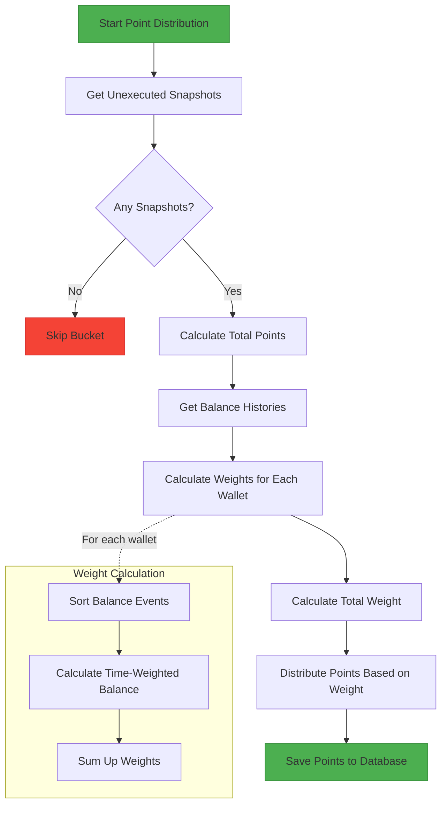

# Point Distribution from BitHive

## Overview

## Detailed Process

1. **Get Unexecuted Snapshots**: Fetches point snapshots that haven't been distributed yet.
2. **Calculate Total Points**: Sums up all points from the snapshots for the current bucket.
3. **Get Balance Histories**: Retrieves all balance change events for the bucket duration.
4. **Calculate Weights**:
   - Sorts balance events by timestamp
   - Calculates time-weighted balance for each wallet
   - Each balance change creates a new time segment
   - Weight = sum(balance * duration_in_minutes) for each segment
5. **Distribute Points**:
   - Total points are distributed proportionally based on each wallet's weight
   - Points = (Wallet's Weight / Total Weight) * Total Points

## Database Tables

1. `balance`: Manages current balance of each wallet in different chains
2. `balance_history`: Tracks history of balance changes for each wallet
3. `balance_bucket`: Defines time buckets for balance calculation
4. `point_snapshot`: Manages Atlas point snapshots from BitHive
5. `point`: Stores point distribution for each wallet per bucket

## Bucket generation

We will use `date-fns` format function to generate bucket name. For example, if we want to generate bucket for 2025-07-25 00:25:00, we will use `format(new Date(2025, 6, 25), 'yyyyMMddHH0000')`. And it will produce `202507250000`